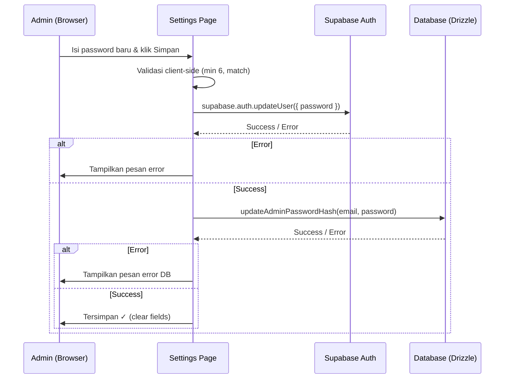

# Bugfix: Password Update Tidak Berfungsi di Halaman Settings

**Bugfix ID:** BF-006
**Status:** Resolved
**Date:** 2026-05-10
**Severity:** High
**Affected Page:** `/admin/settings`

---

## Problem Statement

Admin tidak bisa mengubah password dari halaman Settings. Tombol "Simpan" di bagian Profil Admin hanya menampilkan "Tersimpan" tanpa benar-benar mengupdate password — baik di Supabase Auth maupun di database lokal.

Selain itu, input "Password Baru" dan "Konfirmasi Password" tidak memiliki state binding (uncontrolled tanpa ref), sehingga nilainya tidak bisa dibaca saat submit.

## Root Cause

1. `handleSaveProfile` di `settings/page.tsx` adalah **stub** — hanya `await new Promise((r) => setTimeout(r, 500))` tanpa logic update password
2. Input password tidak memiliki `ref` atau `value`/`onChange` — nilai tidak bisa diakses
3. Tidak ada server action atau API route untuk update password
4. Dua storage terpisah:
   - **Supabase Auth** — menyimpan kredensial login (`supabase.auth.signInWithPassword`)
   - **Tabel `Admin.passwordHash`** — kolom lokal yang menyimpan password dalam bentuk teks biasa
   - Keduanya perlu diupdate agar sinkron

## Solution

### 1. Handle Profile — Client-Side Auth Update (`settings/page.tsx`)

`handleSaveProfile` sekarang menggunakan Supabase browser client (`createBrowserClient`) untuk memanggil `supabase.auth.updateUser({ password })`:

- Membaca nilai password dari `useRef` pada input fields
- Validasi: password minimal 6 karakter dan harus cocok dengan konfirmasi
- Jika sukses: update juga tabel `Admin` via server action
- Jika gagal: tampilkan pesan error dari Supabase

### 2. Server Action — Update Password Hash (`auth-actions.ts`)

Menambahkan `updateAdminPasswordHash(email, password)`:

- Server action yang mengupdate kolom `passwordHash` di tabel `Admin` via Drizzle ORM
- Dicari berdasarkan email (`admin@esk.id`)
- Dipanggil setelah `supabase.auth.updateUser()` sukses

### 3. Input Binding — `useRef` untuk Password Fields

Menambahkan `useRef<HTMLInputElement>` pada input `newPassword` dan `confirmPassword` sehingga nilainya bisa dibaca saat submit.

## Flow Update Password

## Files Modified

- `src/app/admin/(dashboard)/settings/page.tsx` — `handleSaveProfile` rewrite + `useRef` + validasi
- `src/lib/actions/auth-actions.ts` — tambah `updateAdminPasswordHash` server action

## Catatan

- Password diupdate di **dua tempat**: Supabase Auth (untuk login) dan tabel `Admin.passwordHash` (untuk referensi lokal)
- Kolom `passwordHash` menyimpan password dalam bentuk **plain text** (bukan hash) — ini sudah ada sejak sebelum bugfix, tidak diubah
- Server action sebelumnya (`updatePassword`) di-remove karena session cookies tidak reliabel untuk server-to-Supabase-Auth calls

---

*End of Bugfix Documentation*
